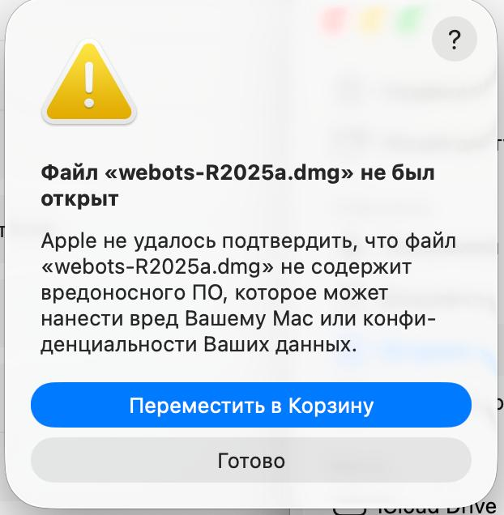
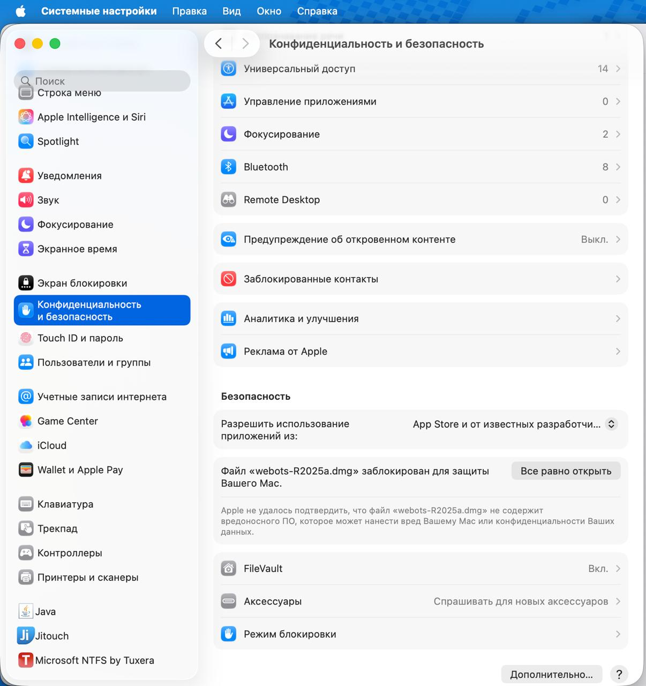
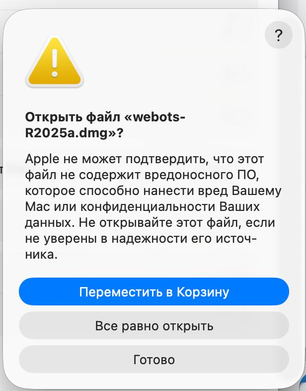
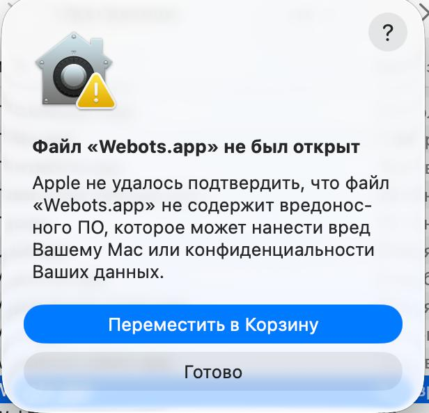

# Summer School Webots Project

Проект для запуска мира `summer_school.wbt` в Webots. В мире используются два e-puck робота и `supervisor`, который принимает команды по TCP/IP.

Для мира используется Webots `R2025a`.

Полный запуск всей связки `Webots + bridge + backend + AI + visualizer` описан в отдельной инструкции:

```text
computer-systems/sim/summer_school/doc/STUDENTS_SETUP.md
```

Этот файл описывает установку Webots и начальную проверку самой симуляции.

## Структура

```text
computer-systems/sim/summer_school/
  worlds/
    summer_school.wbt
    RubberDuck.proto
  controllers/
    epuck_controller/
    supervisor/
  doc/
    README.md
    STUDENTS_SETUP.md
```

## Установка Webots

### Linux / Debian / Ubuntu

Этот вариант подходит для локального запуска с установленным `.deb`-пакетом Webots. По умолчанию Webots ставится в `/usr/local/webots`.

Поставьте базовые утилиты:

```bash
sudo apt update
sudo apt install curl ca-certificates make netcat-openbsd
```

Скачайте и установите Webots R2025a:

```bash
cd /tmp
curl -L -o webots_2025a_amd64.deb \
  https://github.com/cyberbotics/webots/releases/download/R2025a/webots_2025a_amd64.deb
sudo apt install ./webots_2025a_amd64.deb
```

Если `apt` попросит доустановить зависимости, согласитесь. Если установка оборвалась из-за зависимостей:

```bash
sudo apt --fix-broken install
sudo apt install ./webots_2025a_amd64.deb
```

Проверьте установку:

```bash
/usr/local/webots/webots --version
```

Если команда `webots` доступна в `PATH`, можно также проверить:

```bash
webots --version
```

Если ручная сборка контроллеров пишет, что не найден `gcc`, поставьте стандартный набор компилятора:

```bash
sudo apt install build-essential
```

### macOS

1. Скачайте Webots R2025a с официального сайта или страницы релизов:

```text
https://cyberbotics.com/
https://github.com/cyberbotics/webots/releases/tag/R2025a
```

2. Откройте скачанный `.dmg`.

Если macOS блокирует запуск, нажмите `Готово`.



3. Откройте:

```text
Системные настройки -> Конфиденциальность и безопасность
```

и нажмите `Все равно открыть` для Webots.



4. В следующем окне подтвердите запуск кнопкой `Все равно открыть`.



5. Перетащите `Webots.app` в `Applications`.

Если macOS также блокирует запуск `Webots.app`, разрешите его тем же способом через `Конфиденциальность и безопасность`.



Проверка из терминала:

```bash
/Applications/Webots.app/Contents/MacOS/webots --version
```

Если `make` не найден, установите инструменты разработчика:

```bash
xcode-select --install
```

### Windows

1. Скачайте Windows installer Webots R2025a:

```text
https://cyberbotics.com/
https://github.com/cyberbotics/webots/releases/tag/R2025a
```

На странице релиза выберите Windows installer для R2025a.

2. Запустите установщик и оставьте стандартный путь установки:

```text
C:\Program Files\Webots
```

3. После установки запустите Webots через меню Windows или ярлык на рабочем столе.

Проверка из PowerShell:

```powershell
& "C:\Program Files\Webots\msys64\mingw64\bin\webots.exe" --version
```

Если этот путь не сработал, откройте Webots через меню Windows. Для начальной проверки этого достаточно.

## Ресурсы Webots для контроллеров

Makefile контроллеров сначала ищет локальную ссылку `resources/Makefile.include`, а затем использует стандартный путь установки Webots. Обычно отдельная настройка не нужна.

Если на Linux/Debian хочется явно подключить ресурсы Webots, из корня репозитория выполните:

```bash
cd computer-systems/sim/summer_school
ln -sfn /usr/local/webots/resources controllers/epuck_controller/resources
ln -sfn /usr/local/webots/resources controllers/supervisor/resources
```

Проверка:

```bash
ls -l controllers/epuck_controller/resources/Makefile.include
ls -l controllers/supervisor/resources/Makefile.include
```

На macOS локальные ссылки, если нужны, выглядят так:

```bash
cd computer-systems/sim/summer_school
ln -sfn /Applications/Webots.app/Contents/Resources controllers/epuck_controller/resources
ln -sfn /Applications/Webots.app/Contents/Resources controllers/supervisor/resources
```

На Windows обычно достаточно стандартного `WEBOTS_HOME`, который задан в Makefile как:

```text
C:/Program Files/Webots
```

## Начальная сборка контроллеров

Webots обычно собирает контроллеры автоматически при запуске мира.

Для ручной проверки из корня репозитория:

```bash
make -C computer-systems/sim/summer_school/controllers/epuck_controller
make -C computer-systems/sim/summer_school/controllers/supervisor
```

После сборки должны появиться исполняемые файлы контроллеров:

```text
computer-systems/sim/summer_school/controllers/epuck_controller/epuck_controller
computer-systems/sim/summer_school/controllers/supervisor/supervisor
```

На Windows ручную сборку проще запускать из терминала Webots/MSYS2 или позволить Webots собрать контроллеры при открытии мира.

## Начальная проверка Webots-сцены

Этот раздел нужен только для проверки, что Webots и контроллеры работают. Полный запуск с backend, AI и visualizer описан в:

```text
computer-systems/sim/summer_school/doc/STUDENTS_SETUP.md
```

### Linux

Из корня репозитория:

```bash
/usr/local/webots/webots computer-systems/sim/summer_school/worlds/summer_school.wbt
```

Если `webots` есть в `PATH`:

```bash
webots computer-systems/sim/summer_school/worlds/summer_school.wbt
```

### macOS

Из корня репозитория:

```bash
/Applications/Webots.app/Contents/MacOS/webots computer-systems/sim/summer_school/worlds/summer_school.wbt
```

Или откройте Webots из Applications и выберите:

```text
File -> Open World...
```

Затем выберите:

```text
computer-systems/sim/summer_school/worlds/summer_school.wbt
```

### Windows

В PowerShell из корня репозитория:

```powershell
& "C:\Program Files\Webots\msys64\mingw64\bin\webots.exe" "computer-systems\sim\summer_school\worlds\summer_school.wbt"
```

Или откройте Webots через меню Windows и выберите:

```text
File -> Open World...
```

Затем выберите:

```text
computer-systems\sim\summer_school\worlds\summer_school.wbt
```

### Запуск симуляции

После открытия мира нажмите кнопку `Run`.

В консоли Webots должны появиться сообщения:

```text
Supervisor started.
Servers on ports 10000 and 10001, waiting for connections...
```

Это означает, что Webots-supervisor запустился и открыл два TCP-порта:

- `10000` — robot;
- `10001` — agent.

## Начальная TCP-проверка без backend

Этот раздел нужен только для проверки Webots-сцены. Для обычной работы используйте `STUDENTS_SETUP.md`.

Первый робот слушает порт `10000`, второй робот слушает порт `10001`.

Проверка первого робота:

```bash
nc localhost 10000
```

Введите команду и нажмите Enter:

```text
1 3 1 4
```

Проверка второго робота:

```bash
nc localhost 10001
```

Команды, которые можно отправить напрямую в Webots:

```text
1  - вперед
2  - назад
3  - поворот влево
4  - поворот вправо
10 - вперед на две клетки
11 - разворот
12 - шаг вправо
13 - шаг влево
```

Если подключение работает, в консоли Webots появятся сообщения о подключении и полученных командах.

## Полный запуск всей системы

Полный сценарий запуска находится здесь:

```text
computer-systems/sim/summer_school/doc/STUDENTS_SETUP.md
```

Там описано, как вместе запустить:

- Webots;
- `webots_bridge.py`;
- backend;
- AI agent;
- AI visualizer.

Коротко, после начальной проверки Webots используются такие команды:

```bash
SIM_DRIVER=webots ./infrastructure/manual/start-backend-ai-stack.sh
./infrastructure/manual/start-ai-visualizer.sh
```

## Частые проблемы

### Webots пишет `Could not find controller file`

Пересоберите контроллеры:

```bash
make -C computer-systems/sim/summer_school/controllers/epuck_controller
make -C computer-systems/sim/summer_school/controllers/supervisor
```

После этого полностью перезапустите мир в Webots.

### `nc localhost 10000` или `nc localhost 10001` возвращает `Connection refused`

Проверьте, что:

- мир `summer_school.wbt` открыт;
- симуляция запущена кнопкой `Run`;
- в консоли Webots есть строка `Supervisor started`;
- в консоли Webots есть строка `Servers on ports 10000 and 10001`.

### Платформы или утки не сбрасываются при новом раунде

Это проверяется уже в полной связке с backend. Смотрите:

```text
computer-systems/sim/summer_school/doc/STUDENTS_SETUP.md
```

При нажатии `New round` bridge должен отправить в Webots строку `SETUP ...`.
