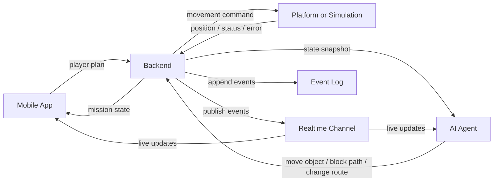

# Архитектура MVP

Этот документ описывает общую систему и связи между треками. Детальные контракты вынесены в отдельные документы:

- [API.md](API.md) — REST API, realtime-события и ошибки.
- [BACKEND_AI_DESIGN.md](BACKEND_AI_DESIGN.md) — проект backend и AI-части, включая game loop и адаптер симуляции.
- [DATA_MODEL.md](DATA_MODEL.md) — сущности, статусы и JSON-модели.
- [GAME_SCENARIOS.md](GAME_SCENARIOS.md) — игровые сценарии и поведение ИИ на поле.
- [IMPLEMENTATION_ROADMAP.md](IMPLEMENTATION_ROADMAP.md) — порядок реализации MVP.
- [ACCEPTANCE_CRITERIA.md](ACCEPTANCE_CRITERIA.md) — чеклист готовности.

## Обзор

Игрок управляет платформой через мобильное приложение. Платформа проходит маршрут на поле, выполняет задания и взаимодействует с объектами. ИИ-агент анализирует состояние миссии и мешает команде: передвигает объекты, блокирует путь, меняет доступность зон и создает ситуации, где движение становится сложнее.

Бэкенд является единственным источником правды. Он хранит состояние миссии, принимает команды игрока, валидирует действия ИИ, отправляет команды платформе или симуляции и публикует события для мобильного приложения, агента и журнала.

## Диаграмма компонентов

## Ответственность компонентов

### Mobile App

- Показывает поле, маршрут, объекты, препятствия, платформу, очки, таймер и действия ИИ.
- Отправляет массив команд (план движения) в бэкенд.
- Получает начальное состояние через REST и обновления через realtime-канал.
- Не решает правила игры и не меняет состояние напрямую.

### Backend

- Хранит состояние миссии, поля, объектов, платформы, очков, заданий и таймера.
- Проверяет команды игрока и действия ИИ.
- Отправляет команды платформе или симуляции.
- Публикует события и ведет журнал.
- Обеспечивает воспроизводимый reset перед новым прогоном.

### AI Agent

- Получает снимок состояния от бэкенда.
- Выбирает вмешательство: переместить объект, заблокировать путь, изменить маршрут или задержать действие.
- Отправляет действие в бэкенд через API.
- Не меняет состояние поля напрямую.

### Platform / Simulation

- Принимает команды движения от бэкенда.
- Возвращает позицию, статус и ошибки.
- Учитывает объекты, препятствия и заблокированные зоны.
- Должна работать в безопасном и воспроизводимом режиме для учебных прогонов.

## Основной поток данных

1. Миссия запускается через бэкенд.
2. Mobile App получает состояние и подключается к live-каналу.
3. Игрок формирует маршрут и отправляет план движения (массив команд).
4. Бэкенд переводит сессию в статус выполнения и начинает пошагово применять команды.
5. Для каждого шага плана: бэкенд передает команду платформе, получает результат, затем вызывает ИИ.
6. ИИ получает состояние и отправляет действие вмешательства.
7. Бэкенд применяет действие ИИ. Если путь заблокирован, выполнение плана прерывается.
8. Mobile App показывает пошаговое выполнение: движение платформы, действия ИИ и возможные прерывания плана.
9. Миссия завершается победой, проигрышем или reset для следующего прогона.

## Архитектурные правила

- Бэкенд — единственный источник правды.
- Все изменения состояния проходят через событие и попадают в журнал.
- ИИ предлагает действие, но бэкенд решает, можно ли его применить.
- Mobile App отображает состояние и отправляет команды, но не хранит игровые правила.
- Platform / Simulation отвечает только за движение, статус и ошибки выполнения.
- MVP должен быть воспроизводимым: одинаковый сценарий дает одинаковые стартовые условия.
