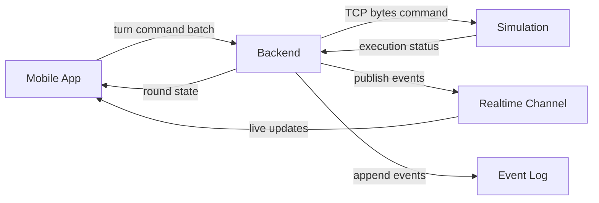

# Архитектура MVP

Этот документ фиксирует базовую архитектуру под обновленную механику:

- на поле есть `agent` и `robot`;
- цель раунда — собрать как можно больше уточек;
- участники ходят по очереди;
- в один ход доступно ровно `5` движений;
- backend отправляет движение в симуляцию строкой байт по TCP на `localhost`.

Детальные контракты вынесены в отдельные документы:

- [API.md](API.md) — REST API и события.
- [BACKEND_AI_DESIGN.md](BACKEND_AI_DESIGN.md) — цикл раунда и TCP-контракт.
- [DATA_MODEL.md](DATA_MODEL.md) — сущности и форматы состояния.
- [GAME_SCENARIOS.md](GAME_SCENARIOS.md) — игровые сценарии.
- [IMPLEMENTATION_ROADMAP.md](IMPLEMENTATION_ROADMAP.md) — этапы внедрения.
- [ACCEPTANCE_CRITERIA.md](ACCEPTANCE_CRITERIA.md) — чеклист готовности.

## Обзор

Backend остается единственным источником правды. Он хранит состояние раунда, валидирует очередность ходов и отправляет команды движения в симуляцию через TCP.

Симуляция отвечает только за исполнение команд и физику перемещения. Парсинг команд на стороне симуляции выполняется по простому формату:

```text
1 2 3 4
```

Где:

- `1` — пройти одну клетку вперед;
- `2` — пройти одну клетку назад;
- `3` — повернуть на 90 градусов влево;
- `4` — повернуть на 90 градусов вправо.

## Диаграмма компонентов



## Ответственность компонентов

### Mobile App

- Показывает поле, позиции `agent` и `robot`, счет по уточкам и текущего участника.
- Отправляет последовательности команд для активного участника.
- Получает состояние через REST и обновления через live-канал.
- Не хранит игровые правила и не пересчитывает очки.

### Backend

- Хранит состояние раунда, позиции, ориентацию и счет.
- Проверяет, чей сейчас ход, и что длина команды не превышает `5`.
- Преобразует команду в TCP-строку формата `1 2 3 4`.
- Отправляет строку в симуляцию по `localhost` и фиксированному порту.
- Публикует события и ведет журнал.

### Simulation

- Слушает TCP-порт команд на `localhost`.
- Парсит входную строку байт и выполняет перемещения.
- Учитывает коллизии и сбор уточек.
- Возвращает backend статус исполнения.

## Основной поток данных

1. Backend запускает новый раунд.
2. Mobile App получает стартовое состояние и активного участника.
3. Для активного участника отправляется пакет команд (до 5 штук).
4. Backend валидирует пакет и формирует строку байт.
5. Backend отправляет строку в симуляцию по TCP.
6. Симуляция исполняет команды и возвращает результат.
7. Backend обновляет состояние, счет уточек и переключает ход.
8. Когда все уточки собраны, backend завершает раунд.

## Архитектурные правила

- Backend — единственный источник правды.
- Формат команд между backend и симуляцией фиксирован: `1`, `2`, `3`, `4`.
- Транспорт команд — только TCP на `localhost`.
- Порт команд задается в конфиге и не дублируется в коде.
- Резервный порт для будущей обратной телеметрии фиксируется заранее в конфиге.
