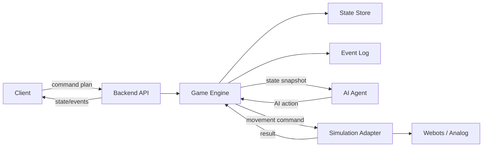

# Backend и AI: проектный дизайн

Документ фиксирует архитектуру backend и AI-части после обсуждения. Цель: дать команде понятный контракт, по которому можно сначала собрать локальную симуляцию, а затем заменить ее Webots или физическим устройством без переписывания игровой логики.

## Ключевое решение

Бэкенд остается единственным источником правды. Игрок, ИИ-агент и симуляция не меняют состояние напрямую. Они отправляют намерения или результаты, а бэкенд валидирует их, применяет правила, пишет событие в журнал и публикует новое состояние.

Игра делится на фазы планирования и выполнения.

Основной цикл:

1. **Фаза планирования:** Игрок формирует маршрут и отправляет массив команд (план).
2. Backend валидирует план и переводит сессию в статус `executing`.
3. **Фаза выполнения (цикл по шагам плана):**
   - Backend берет следующую команду из плана.
   - Backend отправляет команду в simulation adapter.
   - Simulation adapter возвращает результат движения.
   - Backend обновляет состояние платформы и пишет событие.
   - Backend вызывает AI agent со свежим снимком состояния.
   - AI agent возвращает действие вмешательства (например, ставит препятствие).
   - Backend применяет действие ИИ и пишет событие.
   - Если робот уперся в препятствие (из-за ИИ или ошибки игрока), выполнение прерывается, план сбрасывается.
4. После завершения или прерывания плана сессия возвращается в статус `planning`.

## Границы компонентов



## Backend модули

Минимальная структура backend:

- `api` — HTTP endpoints и realtime-канал.
- `domain` — модели `GameSession`, `Field`, `Player`, `Object`, `AIAction`, `GameEvent`.
- `engine` — правила игры и применение команд.
- `agent_client` — вызов ИИ-агента и обработка таймаутов.
- `simulation` — интерфейс адаптера симуляции и конкретные реализации.
- `storage` — хранение состояния и журнала событий.
- `scenarios` — стартовые карты, объекты, задания и параметры баланса.

На MVP можно хранить состояние in-memory или в одном JSON-файле. Важно не смешивать хранение с правилами: правила должны жить в `engine`, чтобы позже заменить хранилище на SQLite/PostgreSQL без изменения игрового цикла.

## AI модули

Минимальная структура AI:

- `policy` — стратегия выбора вмешательства.
- `features` — извлечение признаков из состояния: позиция игрока, цель, короткий маршрут, свободные клетки, история ошибок.
- `actions` — сборка валидных `AIAction`.
- `limits` — ограничения честности: cooldown, максимум вмешательств, запрет полной блокировки.
- `debug` — объяснение решения для журнала.

На MVP агент может быть обычным Python-модулем внутри backend-процесса. Если времени хватает, его можно вынести в отдельный сервис с endpoint `POST /decide`. Контракт должен остаться одинаковым.

## Основные сущности

### GameSession

Прогон игры для одной команды.

Поля:

- `id`
- `teamId`
- `scenarioId`
- `status`: `idle`, `planning`, `executing`, `paused`, `failed`, `completed`
- `field`
- `player`
- `score`
- `timeLeftSec`
- `turn`
- `createdAt`
- `updatedAt`

### Field

Сетка, по которой движется игрок или робот.

Поля:

- `width`
- `height`
- `zones`
- `obstacles`
- `objects`
- `goal`

### Player

Игровое представление платформы или робота.

Поля:

- `id`
- `position`
- `direction`
- `status`: `ready`, `executing`, `blocked`, `error`, `recovering`
- `commandQueue`
- `currentCommandIndex`
- `error`

### GameObject

Объект на поле.

Поля:

- `id`
- `type`: `movable_block`, `task_item`, `obstacle`, `bonus`
- `position`
- `state`: `free`, `occupied`, `moving_by_ai`, `blocking`, `unavailable`
- `movableByAi`

### AIAction

Намерение агента, которое backend обязан проверить.

Поля:

- `type`: `move_object`, `block_path`, `delay_command`, `disable_zone`, `noop`
- `targetObjectId`
- `from`
- `to`
- `reason`
- `confidence`

### GameEvent

Аудит всех важных изменений.

Поля:

- `id`
- `sessionId`
- `turn`
- `type`
- `timestamp`
- `actor`: `player`, `backend`, `ai`, `simulation`
- `payload`

## План игрока

Для клиента фиксируем отправку массива направлений:

```json
{
  "commands": ["up", "up", "right"]
}
```

Допустимые значения: `up`, `down`, `left`, `right`.

Backend пошагово переводит направления в целевые клетки:

- `up`: `y - 1`
- `down`: `y + 1`
- `left`: `x - 1`
- `right`: `x + 1`

Если позже физический робот потребует `move_forward` и повороты, это остается внутренней задачей simulation adapter. Клиент и game engine продолжают работать с массивом сеточных направлений.

## Интерфейс simulation adapter

Backend не должен зависеть от Webots напрямую. Он работает с интерфейсом:

```text
reset(scenario) -> SimulationState
apply_player_command(session, command) -> SimulationResult
apply_environment_update(session, update) -> SimulationResult
get_state() -> SimulationState
```

`SimulationResult`:

```json
{
  "ok": true,
  "position": { "x": 1, "y": 0 },
  "status": "ready",
  "error": null,
  "raw": {}
}
```

На первом этапе нужна `LocalGridSimulation`: она не требует Webots и проверяет правила на сетке. После этого добавляется `WebotsSimulationAdapter`, который переводит сеточные команды в API Webots.

## Интерфейс AI agent

Вход агента:

```json
{
  "sessionId": "session-1",
  "turn": 7,
  "field": {},
  "player": {},
  "score": 80,
  "timeLeftSec": 420,
  "recentEvents": []
}
```

Выход агента:

```json
{
  "type": "move_object",
  "targetObjectId": "box-1",
  "from": { "x": 2, "y": 2 },
  "to": { "x": 4, "y": 2 },
  "reason": "player_is_using_short_route",
  "confidence": 0.74
}
```

Если агент не должен вмешиваться:

```json
{
  "type": "noop",
  "reason": "cooldown_active",
  "confidence": 1.0
}
```

## Правила валидации

Backend отклоняет план игрока, если:

- сессия не в статусе `planning`;
- массив команд пуст или содержит неизвестные команды.

Во время выполнения шага плана движение прерывается, если:
- целевая клетка вне поля;
- целевая клетка занята препятствием или объектом;
- simulation adapter вернул `blocked` или `error`.

Backend отклоняет действие ИИ, если:

- сессия не в статусе `executing`;
- объект не существует или `movableByAi = false`;
- `from` не совпадает с текущей позицией объекта;
- `to` вне поля;
- `to` занята игроком, препятствием или другим объектом;
- действие полностью перекрывает все маршруты к цели;
- превышен лимит вмешательств или активен cooldown.

## Порядок выполнения плана

```text
handle_player_plan(session_id, commands)
  load session
  validate mission is in 'planning' status
  set session.status = 'executing'
  set platform.commandQueue = commands
  append player.plan_submitted
  
  for each command in commandQueue:
    calculate target cell
    if movement blocked:
      append plan.interrupted
      break loop
      
    call simulation.apply_player_command(command)
    apply simulation result
    append platform.updated
    check score / task / completion
    
    build AI snapshot
    call agent.decide(snapshot)
    validate AI action
    apply AI action or append ai.action_rejected
    append AI event
    
    publish events to realtime channel
    sleep(delay) // для визуализации на клиенте
    
  set session.status = 'planning'
  clear platform.commandQueue
  save session
```

Если simulation adapter отвечает долго, backend не должен зависать навсегда. Для MVP достаточно таймаута и события `platform.error`.

## Минимальная стратегия AI

Стартовая стратегия должна быть простой и объяснимой:

1. Проверить cooldown. Если активен, вернуть `noop`.
2. Найти кратчайший маршрут игрока до цели.
3. Найти свободную клетку на этом маршруте, но не рядом со стартом и не на самой цели.
4. Найти ближайший объект `movable_block`.
5. Предложить `move_object` в найденную клетку.
6. Если после перемещения маршрут пропадает полностью, выбрать другую клетку или вернуть `noop`.

Такой агент уже выглядит осмысленным: он реагирует на маршрут, но не ломает игру полностью.

## События MVP

Обязательные события:

- `mission.started`
- `mission.reset`
- `player.plan_submitted`
- `player.plan_rejected`
- `plan.interrupted`
- `platform.updated`
- `ai.decided`
- `ai.noop`
- `ai.action_rejected`
- `ai.object_moved`
- `ai.path_blocked`
- `mission.scored`
- `mission.completed`
- `mission.failed`

Каждое событие ИИ должно содержать `reason`, чтобы участники могли объяснить поведение агента.

## Поэтапная реализация

### Этап A. Backend без Webots

- Создать модели состояния.
- Реализовать in-memory storage.
- Реализовать `LocalGridSimulation`.
- Реализовать endpoints `start`, `mission`, `player/command`, `events`, `reset`.
- Добавить журнал событий.

### Этап B. AI как локальная стратегия

- Создать `agent.decide(snapshot)`.
- Реализовать `noop` и `move_object`.
- Добавить cooldown и проверку маршрута до цели.
- Подключить вызов агента после каждого шага в плане игрока.

### Этап C. Контракт с Webots

- Зафиксировать `SimulationAdapter`.
- Реализовать заглушку `WebotsSimulationAdapter`.
- Описать соответствие сеточных координат и координат Webots.
- Подключить reset и базовое движение.

### Этап D. Realtime и отладка

- Добавить SSE или WebSocket.
- Публиковать события после каждого изменения.
- Сделать debug endpoint или режим логов для объяснения решений AI.

## Что можно поручить участникам

- Изменить стратегию выбора клетки для блокировки.
- Добавить новый тип объекта.
- Настроить лимиты вмешательств ИИ.
- Изменить систему очков и штрафов.
- Добавить новый сценарий поля.
- Реализовать новый simulation adapter.
- Улучшить обработку ошибок платформы.

## Открытые решения

- Webots или аналог выбирается в треке `computer-systems`, но backend уже должен работать через adapter.
- Хранилище для MVP можно оставить in-memory; если нужен replay между запусками, выбрать SQLite.
- Realtime-канал можно сделать SSE, если нужен самый быстрый путь для MVP, или WebSocket, если клиенту нужны двусторонние события.
