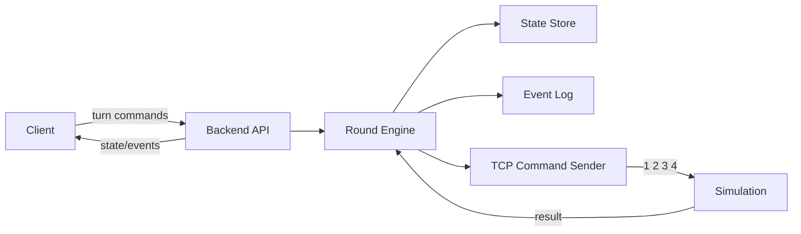

# Backend и Agent: проектный дизайн

Документ фиксирует обновленную архитектуру backend и игрового агента для режима "сбор уточек".

## Ключевое решение

Backend отправляет движения в симуляцию строкой байт по TCP на `localhost`. Формат команд максимально простой:

```text
1 2 3 4
```

Где:

- `1` — клетка вперед;
- `2` — клетка назад;
- `3` — поворот влево на 90 градусов;
- `4` — поворот вправо на 90 градусов.

Порт команд фиксируется в конфиге backend:

- `SIM_TCP_HOST=127.0.0.1`
- `SIM_TCP_COMMAND_PORT=5055`
- `SIM_TCP_TELEMETRY_PORT=5056` (зарезервирован под обратный канал в будущем)

## Игровой цикл

В раунде участвуют два актера: `robot` и `agent`.  
Они ходят по очереди, у каждого хода до `5` движений.

Основной цикл:

1. Backend запускает раунд и назначает `activeActor`.
2. Клиент отправляет `commands` для активного участника.
3. Backend валидирует список команд (`1..4`, длина `1..5`).
4. Backend формирует TCP-строку и отправляет ее в симуляцию.
5. Если TCP-отправка успешна, backend применяет движение локально по правилам поля.
6. Backend обновляет состояние, количество собранных уточек и публикует события.
7. Ход переключается на другого участника.
8. Раунд завершается, когда на поле не осталось уточек.

## Границы компонентов



## Backend модули

Минимальная структура backend:

- `api` — HTTP endpoints и realtime-канал.
- `domain` — модели `Round`, `ActorState`, `Duck`, `GameEvent`.
- `engine` — правила раунда, очередность ходов и подсчет счета.
- `tcp_client` — отправка строки команд в симуляцию.
- `simulation` — TCP-получатель команд движения.
- `storage` — хранение состояния и журнала событий.
- `scenarios` — стартовые позиции и раскладка уточек.

## Agent модули

Если агент автономный (не только через UI), минимальная структура:

- `policy` — выбор хода по текущему состоянию.
- `encoder` — генерация массива команд `1..4`.
- `limits` — ограничение до 5 движений за ход.
- `debug` — пояснение выбора в журнале.

## Основные сущности

### Round

Поля:

- `id`
- `status`: `idle`, `running`, `completed`, `failed`
- `activeActor`: `robot` | `agent`
- `turnNumber`
- `moveLimitPerTurn` (для MVP фиксировано `5`)
- `ducksLeft`
- `score`

### ActorState

Поля:

- `id`: `robot` | `agent`
- `position`
- `direction`
- `collectedDucks`
- `lastError`

### Duck

Поля:

- `id`
- `position`
- `collectedBy`: `robot` | `agent` | `null`

### GameEvent

Поля:

- `id`
- `roundId`
- `turnNumber`
- `type`
- `timestamp`
- `actor`
- `payload`

## Контракт команд для симуляции

На каждый ход backend отправляет одну строку:

```text
1 1 3 1 4
```

Правила:

- Команд в строке от `1` до `5`.
- Разделитель — пробел.
- Другие символы запрещены.
- Пустая строка не отправляется.

В текущем MVP ответ от симуляции не парсится: backend проверяет успешность TCP-отправки и рассчитывает результат хода локально.

## Правила валидации

Backend отклоняет ход, если:

- раунд не в статусе `running`;
- `actor` не совпадает с `activeActor`;
- массив `commands` пуст;
- в массиве есть код вне диапазона `1..4`;
- длина массива больше `5`.

Backend завершает ход с ошибкой `simulation_error`, если TCP-вызов завершился неуспешно.

## Псевдокод обработки хода

```text
submit_turn(round_id, actor, commands)
  load round
  validate round is running
  validate actor is activeActor
  validate commands (1..4, max 5)

  payload = join(commands, " ")
  append turn.submitted
  append simulation.command_sent(payload)

  send_ok = tcp.send(host, commandPort, payload)
  if !send_ok:
    append turn.failed
    return error simulation_error

  apply actor position/direction locally
  apply duck collection locally
  append actor.moved
  append duck.collected (for each duck)

  if ducksLeft == 0:
    set round.status = completed
    append round.completed
  else:
    switch activeActor
    append turn.completed

  save round
```

## События MVP

Обязательные события:

- `round.started`
- `turn.submitted`
- `simulation.command_sent`
- `actor.moved`
- `duck.collected`
- `turn.completed`
- `turn.failed`
- `round.completed`
- `round.reset`

## Открытые решения (на потом)

- Обратный канал из симуляции в backend по отдельному TCP-порту `SIM_TCP_TELEMETRY_PORT`.
- Расширение телеметрии: позиция по каждому шагу, статусы `error/completed`, диагностические коды.
- Выбор постоянного хранилища (SQLite/PostgreSQL) вместо in-memory.
