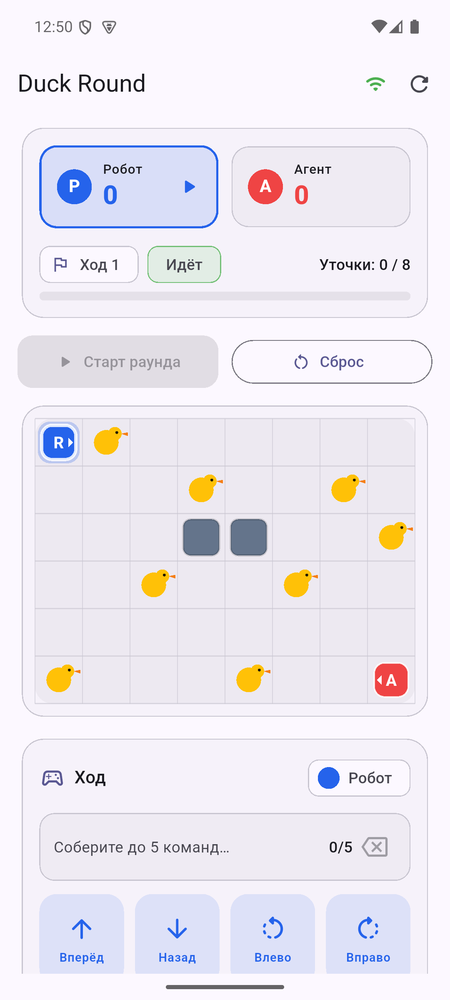

# Duck Round — мобильное приложение (Flutter)

Пульт игрока для игры «Человек против ИИ-агента»: показывает поле, счёт, участников и события, отправляет ходы на backend. Один код — iPhone, Android, Web и Desktop.

> Приложение **ничего не считает**: все правила и расчёты — на backend. См. [ARCHITECTURE.md](ARCHITECTURE.md).



## Что уже работает (MVP)

- Поле `8×6` с уточками, препятствиями, роботом и агентом (с направлением).
- Счёт робота и агента, активный участник, номер хода, прогресс по уточкам.
- Сбор хода из команд (Вперёд/Назад/Влево/Вправо), до 5 за ход, и отправка на backend.
- Лента событий раунда.
- Обновление в реальном времени (SSE + опрос).
- Понятные ошибки: нет связи, недопустимая команда, ошибка симуляции.
- Старт и сброс раунда.

## Быстрый старт

Нужен запущенный backend и заглушка симуляции. Backend на каждый ход шлёт команды в симуляцию по TCP; без слушателя на порту `5055` ход падает с `simulation_error`.

```bash
# терминал 1 — заглушка симуляции (принимает команды на порту 5055)
dart run tool/sim_stub.dart
#   альтернатива без Dart:  nc -lk 5055

# терминал 2 — backend (Kotlin/Ktor, нужен JDK 17)
cd ../backend && ./gradlew run

# терминал 3 — приложение (см. варианты ниже)
flutter pub get
flutter run -d chrome
```

## Куда запускать

| Цель | Команда | Адрес backend |
| --- | --- | --- |
| **Web (Chrome)** — проще всего | `flutter run -d chrome` | `http://localhost:8080` |
| **macOS desktop** | `flutter run -d macos` | `http://localhost:8080` |
| **Windows desktop** | `flutter run -d windows` | `http://localhost:8080` |
| **Android-эмулятор** | `flutter run -d emulator-5554 --dart-define=API_BASE_URL=http://10.0.2.2:8080` | `http://10.0.2.2:8080` |
| **iOS-симулятор** (macOS) | `flutter run -d <sim-id>` | `http://localhost:8080` |
| **Реальный телефон** (та же Wi-Fi) | `flutter run --dart-define=API_BASE_URL=http://IP-компьютера:8080` | IP компьютера |

> Важно: у Android-эмулятора `localhost` — это сам эмулятор, поэтому backend доступен по адресу `10.0.2.2`. Для реального телефона нужен IP компьютера в общей сети.

Список устройств: `flutter devices`. Эмуляторы: `flutter emulators` (запуск — `flutter emulators --launch <id>`).

## Проверка

```bash
flutter analyze   # статический анализ — должно быть «No issues found»
flutter test      # unit + widget тесты
```

## Структура

```
lib/
  main.dart            сборка приложения (DI, тема, запуск)
  core/                конфиг, тема, тип ошибки
  data/                модели, REST-клиент, SSE-клиент, репозиторий
  state/               GameController (ChangeNotifier)
  ui/                  экран и виджеты (поле, статус, команды, события)
test/                  тесты + фейковый репозиторий
tool/
  sim_stub.dart        заглушка симуляции (TCP 5055) для локального запуска
```

## Документация

- [RUN.md](RUN.md) — полная инструкция: что поставить, как запустить и собрать под устройство.
- [ARCHITECTURE.md](ARCHITECTURE.md) — слои, поток данных, принципы.
- [STUDENT_TASKS.md](STUDENT_TASKS.md) — задачи для участников (что дорабатывать).
- [TRACK_BRIEF.md](TRACK_BRIEF.md) — исходное описание трека Mobile.
- [../docs/API.md](../docs/API.md) — контракт backend (REST + события).
